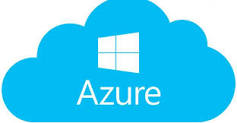

#  Fundamentals of Azure & Web development on Azure 👨‍💻

## Are you a Cloud enthusiast ✨ or a Web enthusiast ?? Want to know the fundamentals of cloud ??
## If Yes , then do join our session on 10th of April at 22:00 (IST)|| 16:30 (GMT).
__What is cloud computing??__

  
 

 
 Cloud computing is the on-demand availability of computer system resources, especially data storage and computing power, without direct active management by the user. 
 
 

  
            

   When you turn on a bulb you don't want to bother about the things happening in the backend of it i.e the passing of currents, wires in the circuit and other things . __Similarly storing data, streaming video, or even hosting a website all require managing hardware and software.Luckily we have cloud to manage all this for us__
   
 
 __Services of cloud:__
 <ol>
 <li>1.Computer Power: Servers, VMs</li>
 <li>2.Storage:databases</li>
 <li>3.Networking: secure connections</li>
 <li>4.Analytics: such as visualizing telemetry and performance data</li>
</ol>
 
We will be teaching you the basics of the  __cloud computing , Microsoft Azure and hosting a Web application on Microsoft Azure.__

Also it will help you in getting your own __personal Website__ , use it for your Project or may be your personal branding.

__Useful resouces for the session__ 👨‍🏫 :
<ul>
  <li>  ▶ https://docs.microsoft.com/en-gb/learn/paths/azure-fundamentals/ </li>
  <li>  ▶https://docs.microsoft.com/en-us/azure/app-service/app-service-web-get-started-html</li>
  <li>▶https://docs.microsoft.com/learn/paths/deploy-a-website-with-azure-app-service/</li>
  <li>▶https://github.com/arkodyuti/hackathon-hackbook</li>
 </ul> 
So dont forget to mark your calender for the session 🗓

### _Azure Days ✨ _
